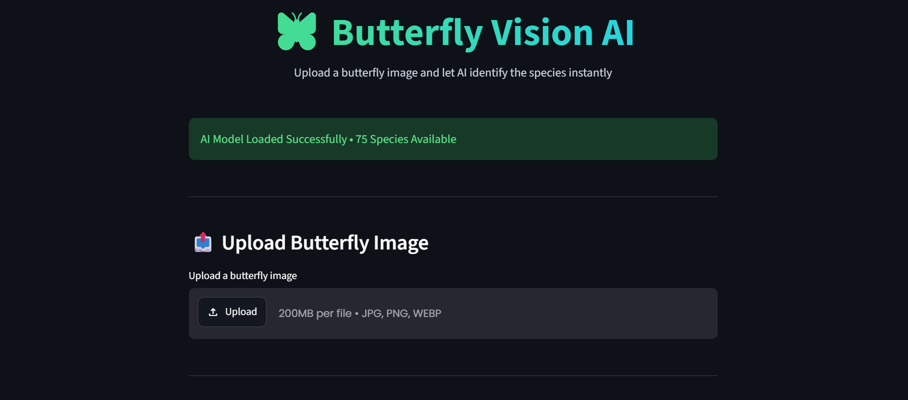

# 🦋 Butterfly Vision AI

<p align="center">
  <strong>AI-powered butterfly species classification from images</strong>
</p>

<p align="center">
  🌐 <a href="https://butterfly-image-classification-ms3rdvz5jwqvagpqrthedo.streamlit.app/">Live Demo</a>
  &nbsp;·&nbsp;
  📦 <a href="https://github.com/MuhammadSharafat/Butterfly-Image-Classification">GitHub Repository</a>
</p>

---

## 📸 Web Application

<p align="center">
  
</p>

---

## 📌 Overview

**Butterfly Vision AI** is a deep-learning image classification application that identifies butterfly species from an uploaded image.

The project uses a **Convolutional Neural Network (CNN)** for image classification and an **ONNX Runtime** model for fast inference. Users can upload a butterfly image through the Streamlit web interface and receive the predicted species, confidence score, and Top 5 predictions.

The current application supports **75 butterfly species**.

## ✨ Features

- 🦋 **Butterfly Species Identification** — Identify butterfly species from uploaded images.
- 🤖 **CNN-Based Classification** — Uses a trained convolutional neural network.
- ⚡ **Fast Inference** — Uses ONNX Runtime for efficient model inference.
- 🌐 **Interactive Web Application** — Built with Streamlit.
- 📤 **Multiple Image Formats** — Supports JPG, JPEG, PNG, and WEBP.
- 🎯 **Confidence Score** — Displays the model's prediction confidence.
- 📊 **Top 5 Predictions** — Shows the five highest-probability species.
- 🎨 **Modern User Interface** — Clean dark-themed web interface.
- 🧠 **75 Butterfly Species** — The deployed model can classify 75 species.

## 🧠 How It Works

```text
                    Butterfly Image
                           │
                           ▼
                     Image Upload
                           │
                           ▼
                    RGB Conversion
                           │
                           ▼
                    Resize 150×150
                           │
                           ▼
                 Pixel Normalization
                           │
                           ▼
                    CNN Model
                    (ONNX Runtime)
                           │
                           ▼
                  Class Probabilities
                       /       \
                      /         \
                     ▼           ▼
            Best Prediction    Top 5
            + Confidence     Predictions
```

## 🛠️ Technologies Used

| Technology | Purpose |
|---|---|
| **Python** | Core programming language |
| **TensorFlow / Keras** | CNN model development and training |
| **ONNX** | Model deployment format |
| **ONNX Runtime** | Model inference |
| **NumPy** | Numerical and image-array processing |
| **Pillow** | Image loading and preprocessing |
| **Streamlit** | Web application and user interface |
| **Jupyter Notebook** | Model development and experimentation |

## 📂 Project Structure

```text
Butterfly-Image-Classification/
│
├── train/                                      # Training images
├── test/                                       # Testing images
│
├── Training_set.csv                            # Training dataset labels
├── Testing_set.csv                             # Testing dataset labels
│
├── butterfly-multiclass-image-classification-cnn.ipynb
│                                                # CNN training notebook
│
├── butterfly_model.onnx                        # Exported trained model
├── class_names.json                             # Butterfly class mapping
│
├── app.py                                      # Streamlit application
├── requirements.txt                            # Python dependencies
├── assets/
│   └── app-preview.png                         # Web app screenshot
└── README.md                                   # Project documentation
```

## 🚀 Run Locally

### 1. Clone the repository

```bash
git clone https://github.com/MuhammadSharafat/Butterfly-Image-Classification.git
cd Butterfly-Image-Classification
```

### 2. Create a virtual environment

**Windows**

```bash
python -m venv venv
venv\Scripts\activate
```

**macOS / Linux**

```bash
python3 -m venv venv
source venv/bin/activate
```

### 3. Install dependencies

```bash
pip install -r requirements.txt
```

### 4. Run the application

```bash
streamlit run app.py
```

The application will open in your browser at the local Streamlit address.

## 🌐 Live Demo

Try the deployed application:

**[Butterfly Vision AI — Live Demo](https://butterfly-image-classification-ms3rdvz5jwqvagpqrthedo.streamlit.app/)**

## 🖼️ Using the Application

1. Open the Butterfly Vision AI web application.
2. Upload a butterfly image.
3. Click **Identify Species**.
4. The model preprocesses the uploaded image.
5. The ONNX model generates predictions.
6. View the predicted butterfly species and confidence score.
7. Check the Top 5 predictions for additional model outputs.

## 📊 Model Inference

For each uploaded image, the application:

- Converts the image to RGB.
- Resizes it to **150 × 150 pixels**.
- Normalizes pixel values to the range **0–1**.
- Sends the processed image to the ONNX model.
- Calculates class probabilities.
- Selects the highest-probability species.
- Displays the Top 5 predictions with confidence percentages.

## 📓 Model Development

The repository includes the Jupyter Notebook:

```text
butterfly-multiclass-image-classification-cnn.ipynb
```

The notebook contains the CNN-based multiclass butterfly image-classification workflow used for model development and experimentation.

The trained model is exported as:

```text
butterfly_model.onnx
```

The corresponding butterfly class labels are stored in:

```text
class_names.json
```

## 📦 Dependencies

The deployed application uses:

```text
Pillow
NumPy
ONNX Runtime
Streamlit
```

For the complete dependency list, see:

```text
requirements.txt
```

## 🔮 Future Improvements

- 📈 Improve classification accuracy.
- 🔍 Add more butterfly species.
- 📱 Improve mobile responsiveness.
- 📚 Add detailed information about each butterfly species.
- 📷 Add camera-based image capture.
- 📊 Add model performance metrics and confusion matrix.
- 🧠 Explore stronger CNN architectures and transfer learning.
- ⚡ Further optimize inference speed.

## 👨‍💻 Author

**Mohammad Sharafat Alam Saki**

**Computer Science & Technology**

### 🔗 Project Links

- 📦 **GitHub:** https://github.com/MuhammadSharafat/Butterfly-Image-Classification
- 🌐 **Live Demo:** https://butterfly-image-classification-ms3rdvz5jwqvagpqrthedo.streamlit.app/

---

<p align="center">
  🦋 <strong>Butterfly Vision AI</strong><br>
  Built with Python, CNN, ONNX Runtime & Streamlit
</p>
